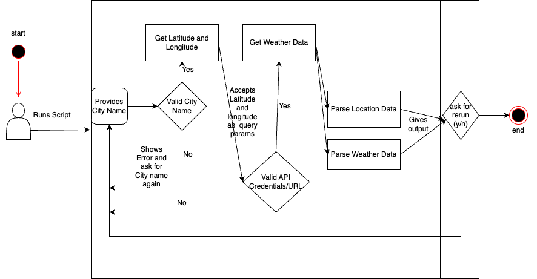
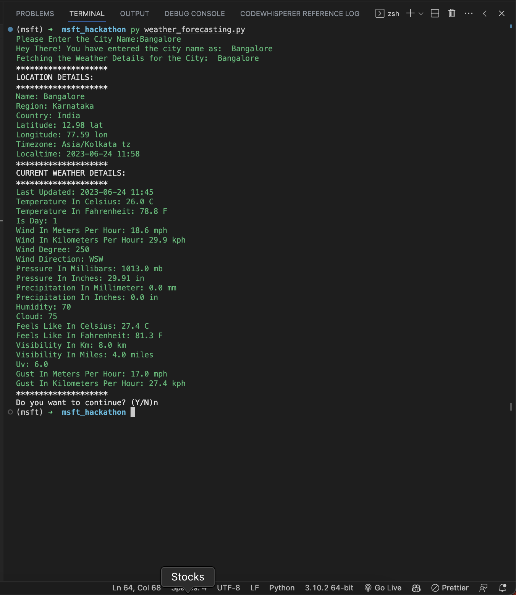

## How to Use?
1. Clone the repository using `git clone` or download the zip file.
2. Extract the zip file and open the folder in your favourite **IDE/Text Editor**.
3. Create a virtual environment using `python -m venv venv`
4. Install the dependencies using `pip install -r requirements.txt`
5. Run the Script using `python main.py`  on **windows** if you are using **linux/mac** use `python3 main.py`
6. Provide the City Name `ex: bangalore`.
7. The Script fetches the data from the API and displays the output.

## Achitecture Design

## Screenshots of the Working Product

## Github Use Cases that I used and how did it help my submission?
1. I used Github Copilot's suggestions to write the code faster and efficiently.
2. The `CHANGABLE_KEY_ITEMS` in `constants.py` file are entirely based on the suggestions from Github Copilot
3. The User can change the items in the list and the script will work as expected.
4. I used Github Copilot to 
   - Write the `README.md` file as well.
   - Optimize the code and make it more efficient.
   - Color the output text in the terminal.
   - To generate Documentation for the each function in the code
   - To Make it more readable
   - To make it more pythonic

### [Click Here to try it on Web](https://weatherforecasting-manjunathauppu.streamlit.app/)

### [Code for Application](https://github.com/manjunani/weatherforecasting_manjunathauppu)